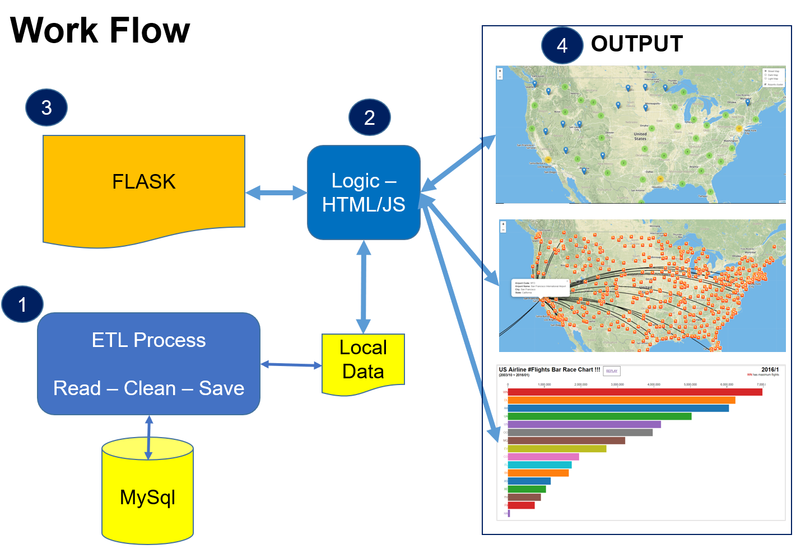
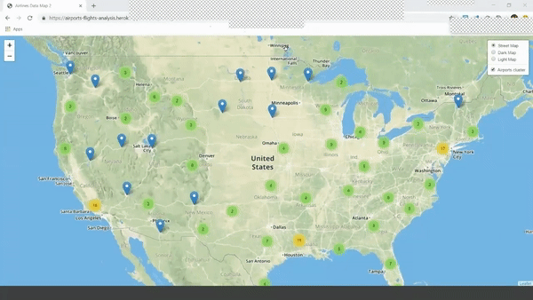
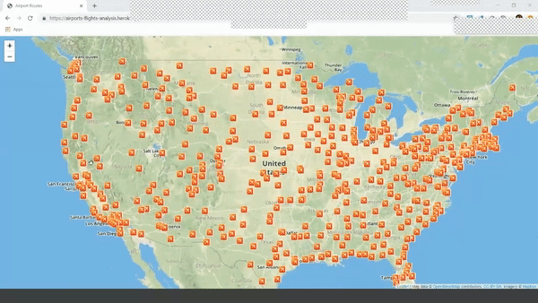
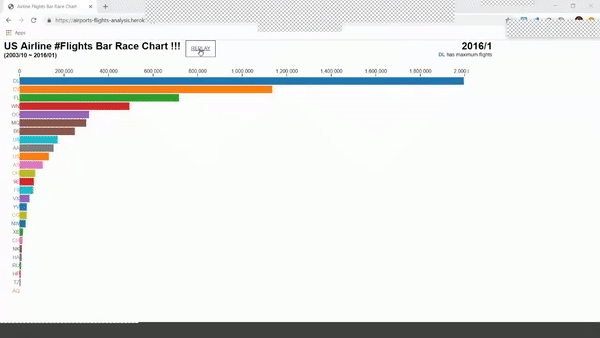

# Airline Information & Statistics

### Author

Bharat, Gokul and Ritesh@2019

App deployed through Heroku in https://airports-flights-analysis.herokuapp.com/

## Introduction

The product consists of three dashboards that visualise the Airlines data in the form of Leaflet Group markers (clustered and grouped by airports), Curved line graps showing the routes of an airport connecting to its various destinations and a Race bar chart which dynamically increases bar indicating the growth of number of flights (Airlines) over a period of time. 

## Approach summary

These datasets were cleaned using Python; imported into a MySQL database; and then converted into interactive dashboards using HTML, CSS, and JavaScript.

## ETL Process

* Read the data source [Airlines data](http://datasets.flowingdata.com/tuts/maparcs/flights.csv)
* Used mysql database for the following:
    * Create a `FLIGHTS_PROJECT` mysql database
    * Create the table FLIGHTS_STATS
* Queries used are available in [mysql queries](Queries.sql)
* In Jupyter Notebook perform all ETL.
* **Extraction**
  * Read the CSV and load into a pandas DataFrame.
* **Transform**
  * Copy only the columns needed into a new DataFrame.
  * Rename columns to fit the tables created in the database.
  * Set index to the previously created primary key.
* **Load**
  * Create a connection to database.
  * Check for a successful connection to the database and confirm that the tables have been created.
  * Append DataFrames to tables. Be sure to use the index set earlier.
* Confirm successful **Load** by querying database.
* Read the data from the mysql database and convert into a json file and csv file
	* [airlines_grouped csv file](static/data/airlines_grouped.csv) - used as input for the first visualization
	* [flights_data json file](static/data/flights_data.json) - used as input for the second visualization

## Description of Files in Github repository

Detailed description on how the project was built:

- Main Data Sources
	- [Airlines data](http://datasets.flowingdata.com/tuts/maparcs/flights.csv)
	- [Airport details](https://gist.github.com/tdreyno/4278655#file-airports-json)
	- [# of Flights over time](https://think.cs.vt.edu/corgis/json/airlines/airlines.json?forcedownload=1)

- Back-end
    - [app.py](https://github.com/contactgokul/airports-flights-analysis/app.py) is a Flask app that creates API endpoints accessible to JavaScript and can render content onto the template
		- @app.route(‘/’) for Main Index File
		- @app.route("/Airportlogicindex") for Airport locations
		- @app.route("/curvedpathindex") for Route Maps
		- @app.route("/barracechartindex") for Bar Race Chart
    - [Flights_Project.ipynb.ipynb](https://github.com/contactgokul/airports-flights-analysis/Flights_Project.ipynb), [Flights_Bar_Race_Chart_Data_Cleaning.ipynb](https://github.com/contactgokul/airports-flights-analysis/Flights_Bar_Race_Chart_Data_Cleaning.ipynb) and [Data_Cleaning.ipynb](https://github.com/contactgokul/airports-flights-analysis/Data_Cleaning.ipynb) for data cleaning and exporting into a database
    -[mysql queries](Queries.sql) is the MySQL database used in this project
    
- Front-end
    - templates/[index.html](https://github.com/contactgokul/airports-flights-analysis/tree/master/templates/index.html) is the dashboard and the template containing text and graphs
    - static/css/[style.css](https://github.com/contactgokul/airports-flights-analysis/tree/master/static/css/style.css) contains formatting specifications
    - static/js/[Airportlogic.js](https://github.com/contactgokul/airports-flights-analysis/tree/master/static/css/Airportlogic.js) is the main logic for the Airports locations visual
	- static/js/[curvedpathlogic.js](https://github.com/contactgokul/airports-flights-analysis/tree/master/static/css/curvedpathlogic.js) is the main logic for the Airport routes visual
    - static/js/[barracechartlogic.js](https://github.com/contactgokul/airports-flights-analysis/tree/master/static/css/barracechartlogic.js) is the main logic for the Bar Race chart visual
	- [leaflet.curve.js](https://elfalem.github.io/Leaflet.curve/src/leaflet.curve.js) is a new java script which has been used to draw a curved path/line between two sets of coordinates
    - static/js/`config.js` contains the API key for mapbox

Final App deployed through Heroku in https://airports-flights-analysis.herokuapp.com/

## Output and Analysis

The landing page of the application has three buttons which direct to three individual dashboards.

* Airport visualization:
The result shows location of airports for each state in an aggregated form. User can Zoom in to find the info/details of each individual airport, # of outbound fights.

* Airport To Airport Route:
The result shows routes from one airport to connecting airports along with the origin airport details.

* Airlines Bar Race Chart:
The result indicated that Delta Airlines (DL) had flown maximum flights

